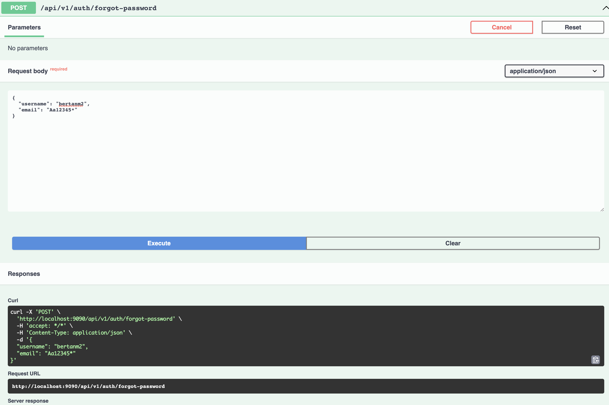

# <u> RECIPE PROJECT </u> 

- This is a backend application, used for the publishment of unique food Recipes.
- Users have to use register the system after that they'll get an activation code which enables them to activate their accounts.
- After the activation process they'll get their token and be able to update their accounts, like the recipes published by the people who got the Role "Admin"
- and if there is a new recipe published which got the same category with the users' favorite, they'll recieve mail about the new added recipe.
- Only people who got the role Admin will have the authorization about simple CRUD methods on recipes. User's can only add recipes to their favorite and use search and filter functions.

## <u>Used Programing Languages </u> 
- Java, Spring Boot

##  <u> Used Technologies: </u> 
- OpenFeign, RabbitMQ, Redis, Zipkin, OpenAPI(SwaggerUI)

## <u> Used DataBases: </u>
- PostgresSQL,MongoDB

## <u>Used Services ve Links: </u>
* [Auth Service](http://localhost:9090/swagger-ui/index.html)
* [Comment Service](http://localhost:9060/swagger-ui/index.html)
* [Recipe Service](http://localhost:9070/swagger-ui/index.html)
* [UserProfile Service](http://localhost:9080/swagger-ui/index.html)
* [Mail Service](http://localhost:9085/swagger-ui/index.html)
* [Config Server](http://localhost:8888/swagger-ui/index.html)

## <u> Auth Service</u>
- Auth Service, is the service where users will register and login to the system.
-   After the registration process user's will get their token and use API Urls in order to take action on the website according to their roles.
 

<u>Register</u> 
   
<u>Login</u> 
   
<u>Forgot Password</u> 

<u>Update Password</u> 
  

## <u>User Service</u>
- User Service is where Users can update their user profile information,
  delete and inactivate their account and add the recipes they liked to their favorite list.
  In order to take notifications about the newly added recipes which are in the same categories as user favorite recipes.
 

<u>Update Users General Information's</u> 
  
<u>Add Favorite Recipes</u> 
  
<u> Un Add Favorite Recipes</u> 
  

## <u> Comment Service </u>
- Comment Service is the service where User actions will take place such as commenting a recipe and also score the
  recipes based on users' opinion.
 

<u>Create Comment and Point</u> 
  
<u>Update Comment and Point</u> 
  
<u>Delete Comment and Point</u> 
  

## <u> Recipe Service </u>
- Recipe Service is the service where users can look for the recipes.
  Search with pre-determined searches according to the ingredient names,
  categories and food names. Also, responsible who got the role "ADMIN" can create,
  update and delete new forms of categories and recipes.
   

<u>Create Recipe</u> 
  
<u>Update Recipe</u> 
  
<u>Delete Recipe</u> 
  

